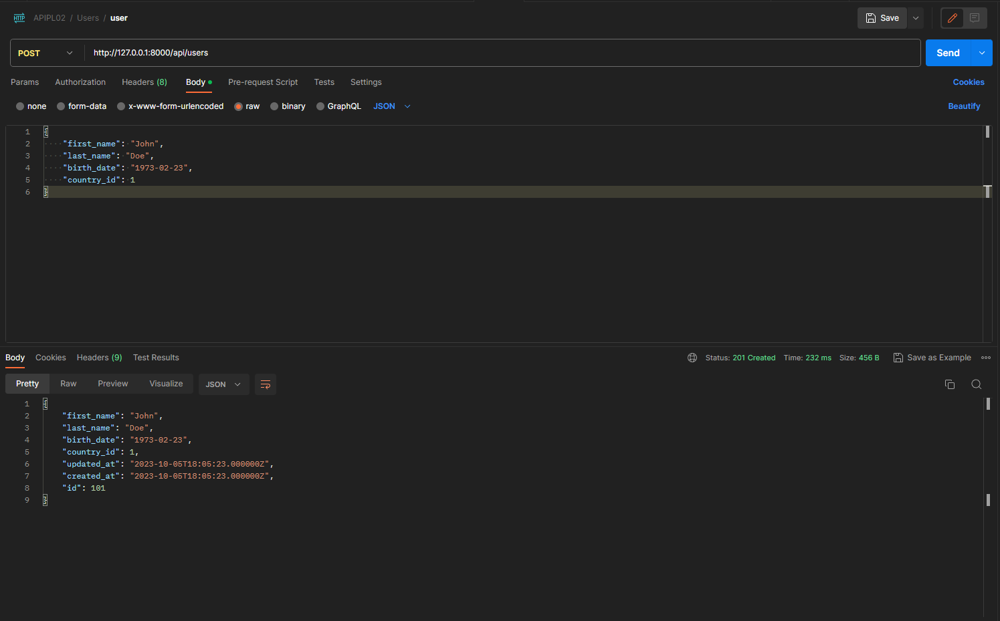

# API
An API will make the connection between the database and the information that's gonna be sent to the user.

  - [Model](#model)
  - [Route](#route)
  - [Controller](#controller)
    - [index](#index)
    - [show](#show)
    - [store](#store)
    - [update](#update)
    - [destroy](#destroy)
    - [search](#search)
  - [POSTMAN](#postman)
  - [Requests](#requests)
    - [GET all users](#get-all-users)
    - [GET user by id](#get-user-by-id)
    - [ADD new user](#add-new-user)
    - [EDIT user](#edit-user)
    - [DELETE user](#delete-user)
    - [SEARCH user](#search-user)
  - [EXPORT API](#export-api)


To create an API we need to have a controller like UserController that will handle the requests and responses. 

Before we work on the controller we need to tell the model which properties we want to be fillable and to create a route that will handle the requests.

## Model
To tell the model the properties that we want to be fillable we need the following code:
```php
protected $fillable = [
    'first_name',
    'last_name',
    'birth_date',
    'country_id'
];
```

## Route
File: `routes/api.php`
```php
Route::apiResource('users', 'UserController');
```
This will add all the routes that we need for the API. If we create a new function inside the controller we need to add the route manually like this:
```php
Route::get('users/search', 'UserController@search');
Route::apiResource('users', 'UserController');
```
This new route MUST be added before the `apiResource` route.

## Controller
File: `app/Http/Controllers/UserController.php`

### index
```php
public function index()
{
    return response()->json(User::all(), 200);
}
```

### show
```php
public function show($user)
{
    return response()->json($user, 200);
}
```
You can also use try-catch to validate if the user exists:
```php
public function show(User $user)
{
    try{
        return response()->json($user, 200);
    }
    catch(\Exception $e){
        return response()->json([
            'message' => 'User not found'
        ], 404);
    }
}
```

### store
```php
public function store(Request $request)
{
    $user = User::create($request->all());
    return response()->json($user, 201);
}
```

### update
```php
public function update(Request $request, User $user)
{
    $user->update($request->all());
    return response()->json($user, 200);
}
```

### destroy
```php
public function destroy(User $user)
{
    $user->delete();
    return response()->json(null, 204);
}
```

### search
```php
public function search(Request $request)
{
    return response()->json(User::orderBy("first_name", "desc")->where('first_name', 'LIKE', '%' . $request.first_name . '%')->get(), 200);
}
```

## POSTMAN
To test the API we can use POSTMAN. We can send requests to the API and see the responses.

First we need to create a new collection. We can then add a 'User' folder inside the collection.

Now we can add the requests according to the methods we added inside the controller.


## Requests
Add new request:


The name given to the request is based on the method and the url. For example, the request for the index method will be named `users` because the url is `http://localhost:8000/api/users`.

The method for the edit request is `PUT` and the url is `http://localhost:8000/api/users/{user}`. The `{user}` is a placeholder for the user id. This is why the request is named `users/{user}`.

### GET all users
After creating a new request we should add the url and the method.

- name: `users`
- url: `http://localhost:8000/api/users`
- method: `GET`


When pressing the `Send` button we should get a response with all the users.


### GET user by id
- name: `users/{user}`
- url: `http://localhost:8000/api/users/1`
- method: `GET`


### ADD new user
To add new user we first need to change the method to `POST` and the url to `http://localhost:8000/api/users`.

- name: `users`
- url: `http://localhost:8000/api/users`
- method: `POST`

Then we need to go to the `Body` tab and select `raw` and `JSON` from the dropdown menu.


After that we can add the user data in JSON format:
```json
{
    "first_name": "John",
    "last_name": "Doe",
    "birth_date": "1990-01-01",
    "country_id": 1
}
```
We then hit `Send` and we should get a response with the new user.



### EDIT user
To edit a user we need to do the same thing as we did in the `POST` where we changed to the `Body` tab and selected `raw` and `JSON` from the dropdown menu.

- name: `users/{user}`
- url: `http://localhost:8000/api/users/101`
- method: `PUT`


### DELETE user
- name: `users/{user}`
- url: `http://localhost:8000/api/users/101`
- method: `DELETE`


### SEARCH user
- name: `users/search`
- url: `http://localhost:8000/api/users/search`
- method: `GET`
  
For this method we need to go to the `Params` tab and add a new parameter with the key `first_name` and the value `John`. The output will most likely be empty since we deleted the user "John Doe" but if we add a user with `John` as first name it will show at least that user.


**WARNING**

This will only work for `first_name` parameter since we only added that parameter inside the controller. If we want to search by other parameters we need to add them inside the controller.


## EXPORT API
In the end we can export the collection to a JSON file.
---
[TOP](#api)

[BACK](./)