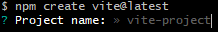

# VUE

## Index

- [Asynchronous operations](#understanding_asynchronous_operations)
- [DB Setup](db-setup.md)
- [Views](views.md)
- [CRUD](CRUD.md)
- [API](API.md)

## UNDERSTANDING ASYNCHRONOUS OPERATIONS

### What is an asynchronous operation?

An asynchronous operation is an operation that runs in the background while the rest of the program continues to run. Fetching data from an API is an example of an asynchronous operation as the web application continues to run while the data is being fetched.

### Promisses

A promise is an object that allows us to wait for a result. It can be considered as a return to a function but in asynchronous contexts, the exact timing of when it will be returned is unpredictable. Promises can be resolved after a specific duration, following an action, or in response to an event.

### Async/Await

This is a syntactic feature that allows us to write asynchronous code that looks and behaves like synchronous code, letting us create asynchronous functions that are easier to read and understand.

`async` is a keyword that is used to define an asynchronous function.

`await` is a keyword that is used to tell the program to wait for a promise to resolve before continuing to execute the code.

### Callback

A callback is a function that is passed as an argument to an asynchronous operation and is queued up to be executed when that asynchronous operation ends. These functions are defined to handle the behavior of the asynchronous operation when it is completed.

### Fetch

The `fetch()` method is used to make a request to the server and retrieve a response. It preforms an asynchronous operations that return a promise (in the form of a response) and executes callback functions `then()` and `catch()`.

Requests: 
- GET: retrieves data from the server
- POST: sends data to the server
- PUT: updates data in the server
- DELETE: deletes data from the server

`fetch()` structure:

```javascript
fetch('https://api.example.com/data')
  .then(response => {
    if (!response.ok) {
      throw new Error('Network response was not ok');
    }
    return response.json(); // returns response promise and converts to json
  })
  .then(data => {
    console.log('Data from API:', data); // callback function that uses the data
  })
  .catch(error => {
    console.error('Error:', error); // callback function that handles errors
  });

```


---

## VUE SETUP

To create a new Vue project, run the following command:

```bash
npm create vite@latest
```

After this command you will be asked to give a name to the project



Then it will ask to choose a framework and a variant:
- Framework: Vue
- Variant: JavaScript

We can now open the project with the following command:

```bash
code <projectName>
```

or
  
```bash
cd <projectName>
code .
```

Now whenever we want to run the project we just need to use the command:

```bash
npm run dev
```

And if we want to stop running the project we just press `Ctrl + C` in the terminal.

---

## VUE STRUCTURE

### App.vue

This is the main file of the program. This is the view that we see when we start running the project.

Every component created should be added in this file

### Components

Every bit of code that can be reused should be made into a component so that we can use it anywhere we want without the need to copy-paste several lines of code.

These bits of code should be stored in `.vue` files, preferably inside the `src/components/` folder.


## VUE DIRECTIVES

### v-on

### v-if


### v-else

### v-else-if

### v-show

### v-bind


